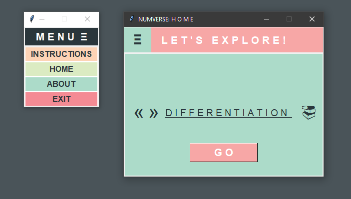

 
### Hi 👋 I am Rome!
Over the years, I've dived into numerous projects, constantly honing my skills and expanding my knowledge. I'm excited about the opportunity to help businesses thrive in the digital age and can't wait to contribute to meaningful projects. Feel free to explore and test my works :)   

Here's an overview of what my works.

## Applications 
### NUMVERSE - Numerical methods calculator and learning guide.

Demo Video
https://github.com/romeyiow/romeyiow/assets/77595388/e1319fc5-76f0-49d6-85b2-6c8d54b31e94

### 

## Websites

<!--
https://youtu.be/9XVPOBkYM0w
## Watch the Video

### [👉Live Demo 👀](https://prxncxss03.github.io/freedom-board-front-end/)
## Hi there 👋
**romeyiow/romeyiow** is a ✨ _special_ ✨ repository because its `README.md` (this file) appears on your GitHub profile.

Here are some ideas to get you started:

- 🔭 I’m currently working on ...
- 🌱 I’m currently learning ...
- 👯 I’m looking to collaborate on ...
- 🤔 I’m looking for help with ...
- 💬 Ask me about ...
- 📫 How to reach me: ...
- 😄 Pronouns: ...
- ⚡ Fun fact: ...
-->
## License

